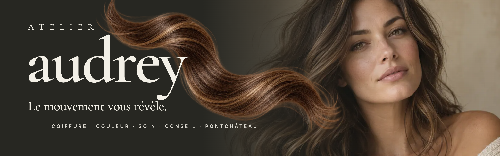
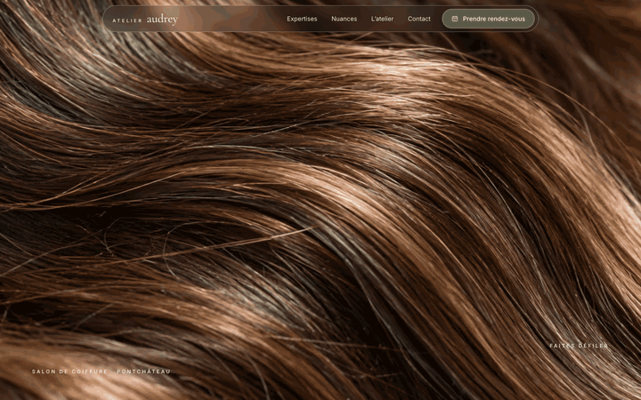
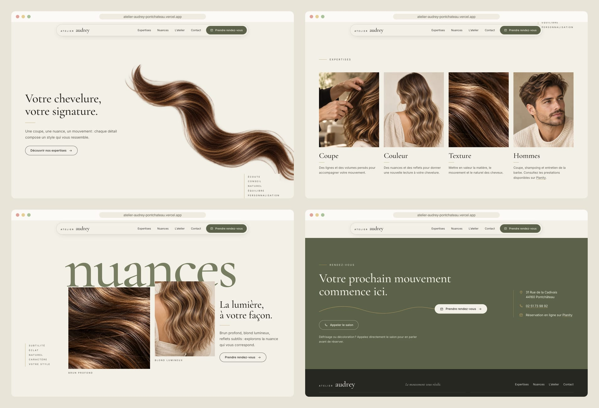
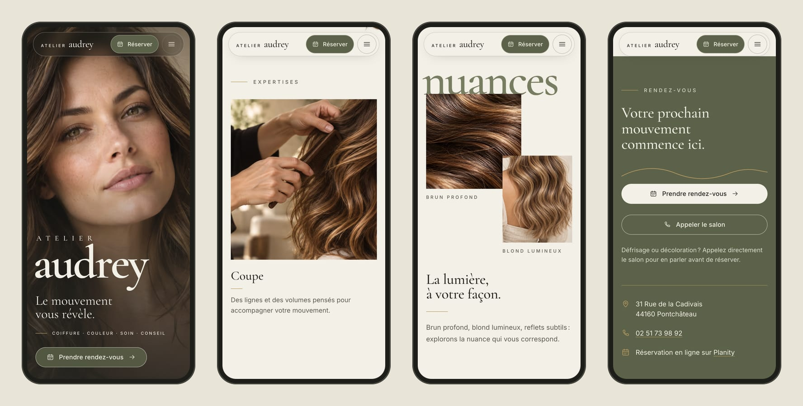

<div align="center">



<h3>A one-page website for a hair salon in Pontchâteau, built around a scroll-driven reveal: from the matter of the hair to the portrait.</h3>

<p>
  <a href="https://atelier-audrey-pontchateau.vercel.app"><strong>🌐 Live site</strong></a>
  &nbsp;·&nbsp;
  <a href="#hero-animation"><strong>🎬 How the hero works</strong></a>
  &nbsp;·&nbsp;
  <a href="#getting-started"><strong>🛠️ Run it locally</strong></a>
</p>

<p>
  <a href="https://atelier-audrey-pontchateau.vercel.app"></a>
  
  
  
  
</p>

</div>

<br />

## 🚀 Overview

**Atelier Audrey** is a hair salon at 31 Rue de la Cadivais in Pontchâteau. The site follows one idea from the approved creative direction: ***Le mouvement vous révèle***, movement reveals you. As you scroll, the camera starts inside the strands, a portrait emerges from them, a loose strand of hair crosses the frame, and the composition opens onto the salon's specialities.

The curve of the hair then becomes the thread of the page: it returns in **Signature**, drifts through **Nuances**, and ends as a gold line that leads straight into the booking button.

- **Cinematic first impression**: a pinned hero made of real photographs, masks and transforms, not a video
- **One clear path to booking**: every call to action opens the salon's **Planity** page, with a direct **call** button beside it
- **Honest content**: photographs are labelled as illustrations, and there are no prices, opening hours or reviews, as the brief asks
- **Light**: 317 KB on a phone and 515 KB on desktop for the first load, fonts and hero images included

<br />

<a name="hero-animation"></a>

## 🎬 The hero animation

<div align="center">
  <a href="https://atelier-audrey-pontchateau.vercel.app"></a>
  <sub>Scroll-scrubbed on the live site · captured at 1440 × 900</sub>
</div>

<br />

The hero track is 2.4 screen heights tall, so the stage stays pinned for 1.4 screens of scroll. It follows the kit's written motion script (`02-animacao.md`):

| Scroll  | What happens                                                                                                   |
| :------ | :------------------------------------------------------------------------------------------------------------- |
| 0–18%   | A macro of the strands fills the stage and slowly settles (scale 1.12 → 1.04)                                  |
| 18–42%  | The portrait appears through a soft circular mask that grows **from the face**, blur 8 → 0 px; the title rises |
| 42–65%  | A transparent strand of hair crosses the foreground, behind the title (2D only: −10% to 12%, −4° to 2°)        |
| 65–88%  | The text steps back; the portrait narrows to 58% of the width; **Coupe**, **Couleur** and **Texture** open     |
| 88–100% | A short hold, then the stage releases into **Signature** on the same ivory ground                             |

**Under the hood**

- 🧩 **Three photo layers, no canvas.** Macro, portrait and the alpha strand are stacked in one sticky stage. Only `transform`, `opacity`, `mask-image`, `clip-path` and a single blur are animated.
- 📐 **Measured, not guessed.** The face centre (63.4%, 34%) was read from gridded overlays of the source photo. The reveal mask is anchored there, and the narrowing is a `clip-path`, so the face is never scaled or distorted.
- 🗂️ **Script as data.** Every range in the table lives in `src/data/timeline.js`; `src/js/hero.js` only interpolates it, with a smoothed progress and `?nosmooth` / `?p=0.5` flags for frame-exact captures.
- 🐢 **Graceful by default.** Below 1024 px the sequence shortens to macro → portrait on a 150 svh track, with no animated blur and the strand limited to 4% of movement, kept below the face. With `prefers-reduced-motion`, on very short screens or without JavaScript, the hero is the still portrait with its title. The desktop-only panel images are never downloaded on phones.

<br />

## 🖥️ Sections

<div align="center">
  
</div>

<br />

| #   | Section                                       | Anchor         | Role                                                                                  |
| :-- | :-------------------------------------------- | :------------- | :------------------------------------------------------------------------------------ |
| 01  | **Atelier audrey · Le mouvement vous révèle.** | `#top`         | First impression and first booking button                                             |
| 02  | **Votre chevelure, votre signature.**         | `#signature`   | The salon's promise, carried by the strand of hair                                    |
| 03  | **Expertises**                                | `#expertises`  | Coupe, Couleur, Texture and Hommes, each opening with a vertical mask                  |
| 04  | **La lumière, à votre façon.**                | `#nuances`     | Brun profond and blond lumineux under a giant *nuances*, with a slow lateral drift    |
| 05  | **Un atelier, une attention.**                | `#atelier`     | The care of the gesture, in Pontchâteau                                               |
| 06  | **Votre prochain mouvement commence ici.**    | `#rendez-vous` | Planity booking, call button, address; the gold line ends at the button               |
| 07  | Footer                                        | n/a            | Wordmark, contacts and the note that photographs are illustrations                    |

<br />

## 📱 Mobile first, motion optional

<div align="center">
  
</div>

<br />

- A dedicated portrait crop for phones keeps the face visible at every height
- Cards stack in a single column in the natural flow of the page; the booking and call buttons go full width
- A compact menu with **Réserver** always in view; every touch target is at least 44 px
- No horizontal scroll from 360 px to 1920 px, and the fixed navigation fits from 320 px up

<br />

## ✨ Highlights

- **🎞️ Scroll storytelling**: a hand-written timeline mapped one to one to the creative kit's motion script
- **🖼️ Image pipeline**: the kit's PNGs stay as sources; `npm run images` crops and exports AVIF and WebP in several widths, including the alpha strand
- **🏗️ Content in the HTML**: a small Vite plugin writes the address, phone, booking link and every `<picture>` (with width and height) into the page at build time, so it all works without JavaScript
- **📅 Booking without a backend**: Planity for appointments, a call button for colour removal and straightening, as the brief recommends. No fake form.
- **♿ Accessible components**: skip link, visible gold focus ring, menu with `aria-expanded` and Escape to close, semantic sections and headings, reduced motion respected
- **🎨 Contrast by design**: text on sage uses a deeper sage (5.6:1); the gold stays decorative
- **🔎 Ready to share**: Open Graph image captured from the hero, structured data (`HairSalon`) and canonical URL; `noindex` until the salon approves the site

<br />

## 💻 Tech stack

| <br />Vite 6 | <br />JavaScript | <br />HTML5 | <br />CSS3 | <br />Node + sharp | <br />Vercel |
| :---: | :---: | :---: | :---: | :---: | :---: |

### Why this stack?

- **Vite + plain JavaScript**: a one-page site doesn't need a framework runtime; the page is static HTML with three small modules (8 KB of JavaScript)
- **A hand-written scroll timeline**: one sticky stage and a handful of interpolated values did not justify an animation library
- **sharp**: reproducible crops and AVIF/WebP exports straight from the kit's originals
- **Self-hosted Cormorant Garamond and Inter**: the editorial serif and a legible sans, without third-party font requests
- **Vercel**: every push to `main` deploys automatically

<br />

## 🎨 Design system

| Token      | Value                                                                        | Use                                         |
| :--------- | :--------------------------------------------------------------------------- | :------------------------------------------ |
| Ivory      |  | Page ground, light navigation               |
| Sage       |  | The giant *nuances*                         |
| Deep sage  |  | Buttons, Rendez-vous band (5.6:1 with ivory) |
| Charcoal   |  | Text, hero ground, footer                   |
| Gold       |  | Rules, focus ring, the closing line         |

- **Type**: Cormorant Garamond for display (the hero wordmark up to 288 px, headings 38–70 px) and Inter for text, 16–18 px
- **Grid**: 1,440 px content width, 12 columns, 24 px gutters, fluid margins from 20 to 72 px
- **Rhythm**: 88–168 px between sections, depending on the width
- **Motion**: clip-path reveals of 600 ms with a stagger capped at 90 ms, 16 px fades, scroll drifts of 4% at most

<br />

<a name="getting-started"></a>

## 🛠️ Getting started

```bash
# Clone the repository
git clone https://github.com/Jeanfr1/audreyatelierwebsite.git
cd audreyatelierwebsite

# Install dependencies (Node 20+)
npm install

# Start the dev server  →  http://localhost:5173
npm run dev

# Production build  →  dist/
npm run build

# Preview the production build
npm run preview

# Regenerate the AVIF/WebP images from the kit's PNGs
npm run images
```

<br />

## 📁 Project structure

```
audreyatelierwebsite/
├── index.html                    # Every section: hero → signature → expertises → nuances → atelier → rendez-vous → footer
├── vite.config.js                # Build-time plugin: contacts, JSON-LD and <picture> markup from the data files
├── src/
│   ├── css/main.css              # Tokens, grid, components, hero modes, reveal states
│   ├── data/
│   │   ├── site.js               # Business facts (address, phone, Planity) with their sources
│   │   ├── timeline.js           # Hero scroll script (full + compact)
│   │   └── asset-meta.json       # Image sizes and files (generated)
│   └── js/
│       ├── main.js               # Entry: fonts, styles, module init
│       ├── hero.js               # Mode detection, smoothed progress, layer interpolation
│       ├── nav.js                # Mobile menu, light/dark navigation tone
│       └── reveal.js             # Section reveals, Nuances and Signature drifts
├── public/
│   ├── img/                      # AVIF + WebP derivatives (generated)
│   ├── og-image.jpg              # Open Graph image captured from the hero
│   └── favicon.svg
├── scripts/build-images.mjs      # Measured crops → AVIF/WebP (sharp)
└── atelier-audrey-editorial/     # The creative kit: direction, mockups, motion script, French copy, original PNGs
```

<br />

## 🚀 Deployment

Hosted on **Vercel** and connected to this repository: every push to `main` ships to production.

**Live site:** [atelier-audrey-pontchateau.vercel.app](https://atelier-audrey-pontchateau.vercel.app)

| Setting          | Value           |
| :--------------- | :-------------- |
| Framework        | Vite            |
| Build command    | `npm run build` |
| Output directory | `dist`          |

The creative kit is kept in the repository and left out of the deploy (`.vercelignore`).

<br />

## 📌 Content checklist

Items waiting on the salon. Each one is marked `TODO(audrey)` in the code.

- [ ] Official logo files (the circular mark in the mockup is a concept; an HTML wordmark stands in)
- [ ] Approved photographs of the salon and its clients to replace the conceptual images, plus a photo of the salon interior for **L'atelier**
- [ ] Link to the salon's own Google Maps listing, and opening hours if the salon wants them shown
- [ ] Custom domain, then update `canonical`, `og:url` and `og:image`, and remove `noindex`

Choices made where the kit contradicted itself:

- **Order**: the motion script has the hero hand over the expertise grid, while the copy file and storyboard put **Signature** first. The hero now opens the three panels as a preview and settles on ivory; the full grid follows Signature.
- **Copy**: texts come from `03-secoes-fr.md`, not from the text drawn in the mockups. The mockup's "Le salon" and "Inspirations" links have no pages, so the menu lists the sections.
- **Expertises**: four cards (the brief adds **Hommes**) instead of the mockup's three.
- **Hours**: the mockup's "Lundi – Samedi" is left out, since the brief forbids unconfirmed hours.
- **Accents**: the mockup's small vertical lists are kept; "Expertise" became "Conseil", taken from the brief's own *Coiffure · Couleur · Soin · Conseil*.

<br />

## 🙏 Acknowledgments

- The ***Le mouvement vous révèle*** creative direction kit: mockups, motion script and French copy
- **[Cormorant Garamond](https://fonts.google.com/specimen/Cormorant+Garamond)** by Christian Thalmann (OFL)
- **[Inter](https://rsms.me/inter/)** by Rasmus Andersson (OFL)
- **[sharp](https://sharp.pixelplumbing.com)** for the image pipeline
- **[Vite](https://vite.dev)** and **[Vercel](https://vercel.com)**

<br />

---

<div align="center">
  
  <p><strong>Le mouvement vous révèle</strong></p>
  <p>Built with ❤️ by <a href="https://github.com/Jeanfr1">Jean</a> for Atelier Audrey</p>
  <sub>© 2026 Atelier Audrey. All rights reserved.</sub>
</div>
